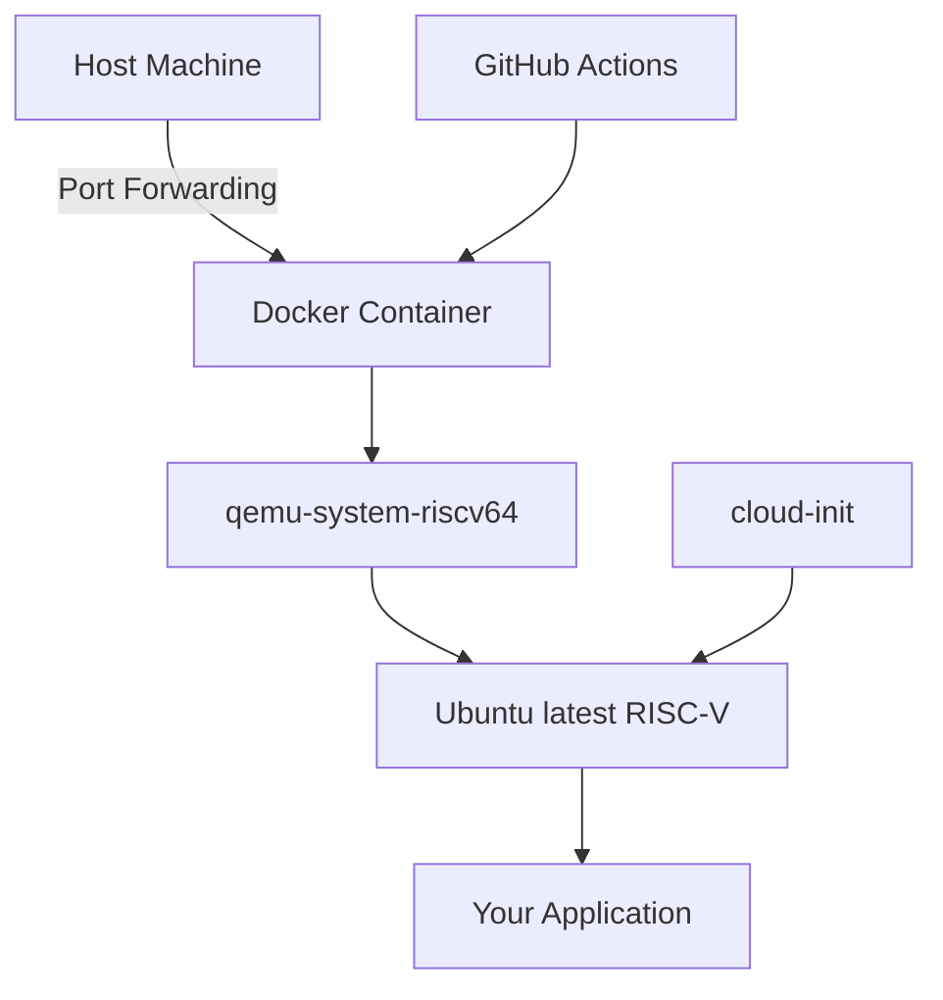
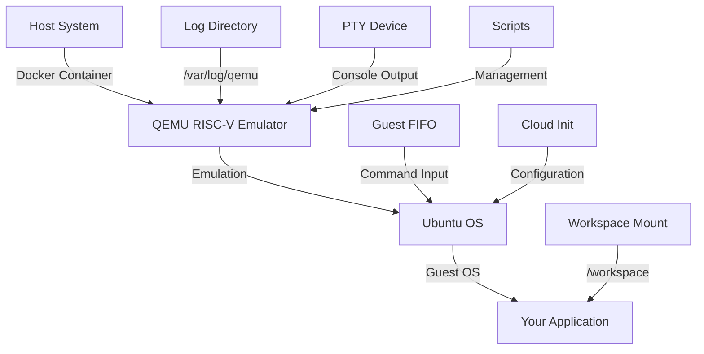

# RISC-V Testing Environment

A RISC-V testing environment image using QEMU virtualization. Designed for CI/CD pipelines.

## Overview

This repository provides a Docker-based RISC-V emulation environment running Ubuntu latest (24.04 now), primarily focused on:
- Testing of RISC-V applications and systems
- CI/CD pipeline integration via GitHub Actions


## Image Architecture



### Component Structure

```
.
├── Dockerfile          # Container definition
├── cloud-init/         # VM initialization
├── scripts/           
│   ├── entrypoint.sh   # Container entry
│   ├── shell.sh        # Interactive shell
│   └── bake-snapshot.sh # VM state management
├── tests/              # Test suites
└── workspace/          # Mount point for user code
```

## Features

- **Base System**: Ubuntu 24.04 with RISC-V support
- **QEMU Version**: Latest stable QEMU with RISC-V system emulation
- **Memory**: Configurable VM memory (default: 4GB)
- **Storage**: Expandable disk image
- **Networking**: Configurable port forwarding
- **cloud-init**: Automated VM configuration
- **CI/CD Ready**: GitHub Actions integration

## Quick Start

This image provides two primary ways to test your RISC-V applications: GitHub Actions integration and local testing.

### 1. GitHub Actions Integration

To integrate RISC-V testing in your CI pipeline, we provide ready-to-use templates:

- [`example-01.yml`](.github/workflows/example-01.yml) - Complete workflow example with QEMU setup
- [`common.sh`](.github/scripts/common.sh) - Essential helper functions for VM management

#### Basic Workflow Example

```yaml
name: RISC-V Tests

on:
  push:
    branches: [ main, dev ]

jobs:
  riscv-test:
    runs-on: ubuntu-latest
    env:
      CONTAINER_NAME: riscv-test
      LOG_DIR: ${{ github.workspace }}/var/log/qemu
      WORK_DIR: ${{ github.workspace }}
    
    steps:
      - uses: actions/checkout@v4
      
      - name: Setup RISC-V Environment
        run: |
          # Source helper functions
          source .github/scripts/common.sh          
          mkdir -p "${LOG_DIR}"
          
          start_qemu_container "${CONTAINER_NAME}" "${WORK_DIR}" "${LOG_DIR}"
          
          # Wait for system boot
          wait_for_qemu_boot "${CONTAINER_NAME}" "${LOG_DIR}/console.log"
      
      - name: Run Tests
        run: |
          # System verification
          source .github/scripts/common.sh
          run_guest "uname -a"
          run_guest "cat /etc/os-release"
          
          # Your test commands here
          # build/test your app using similar functions.
      
      - name: Upload Logs
        if: always()
        uses: actions/upload-artifact@v4
        with:
          name: riscv-logs
          path: ${{ env.LOG_DIR }}
```

Key Features:
- Automatic QEMU setup and boot
- Helper functions for command execution
- Log collection and artifact upload
- Configurable test environment


### Local Image build 

```bash
make build
make run

# Run with custom settings
docker run -d -t --name riscv-test --privileged \
-e AUTO_ATTACH=0 -e RUN_TESTS=0 \
-v "$PWD/workspace":/workspace \
-v "$PWD/var/log/qemu":/var/log/qemu 
cloudv10x/riscv-qemu-ubuntu:latest
```

## Configuration

### Environment Variables

| Variable | Default | Description |
|----------|---------|-------------|
| RISCV_MEMORY | 4G | VM memory allocation |
| RISCV_CPUS | 2 | Number of virtual CPUs |
| BOOT_TIMEOUT | 300 | VM boot timeout (seconds) |
| SSH_HOST_PORT | none | SSH port forwarding |

### Cloud-Init Configuration

Customize VM initialization by modifying:
- `/cloud-init/user-data`
- `/cloud-init/meta-data`
- `/cloud-init/network-config`

## Development Workflow

1. Mount your RISC-V application code to `/workspace`
2. Access the VM via SSH or serial console
3. Build and test your application in the RISC-V environment
4. Use snapshots for repeatable testing

## CI/CD Pipeline Integration

# RISC-V Ubuntu Development Environment

A comprehensive RISC-V emulation environment using QEMU for testing and development of RISC-V applications in a containerized Ubuntu environment.

## Architecture and Internal Working




## License

This project is licensed under the MIT License - see the LICENSE file for details.

## References

- [QEMU RISC-V Documentation](https://www.qemu.org/docs/master/system/target-riscv.html)
- [Ubuntu RISC-V](https://ubuntu.com/download/risc-v)
- [GitHub Actions Documentation](https://docs.github.com/en/actions)
